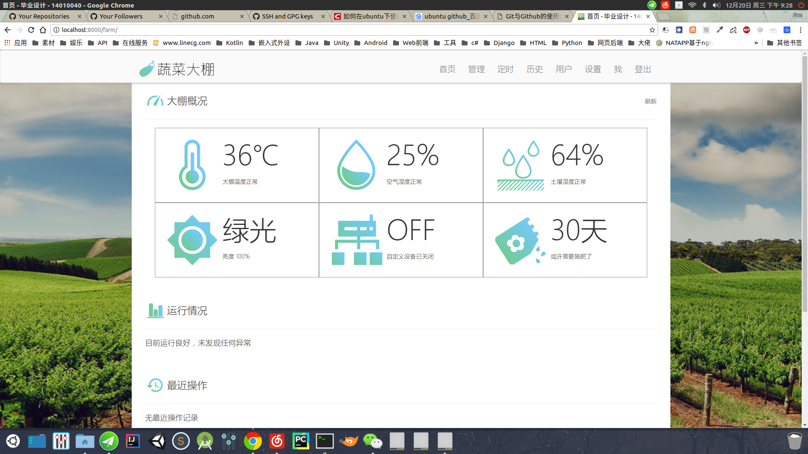
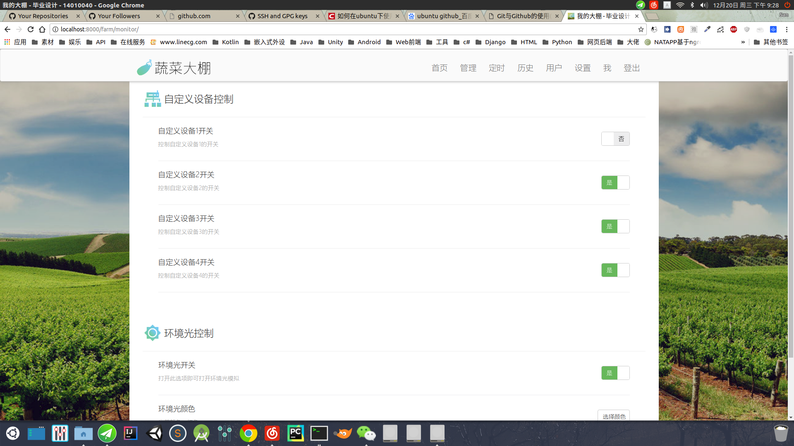
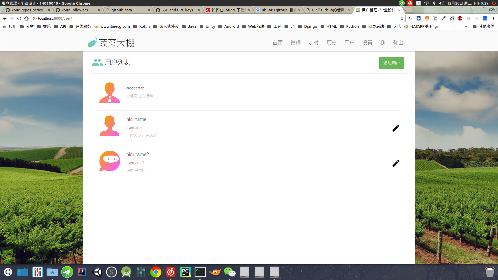
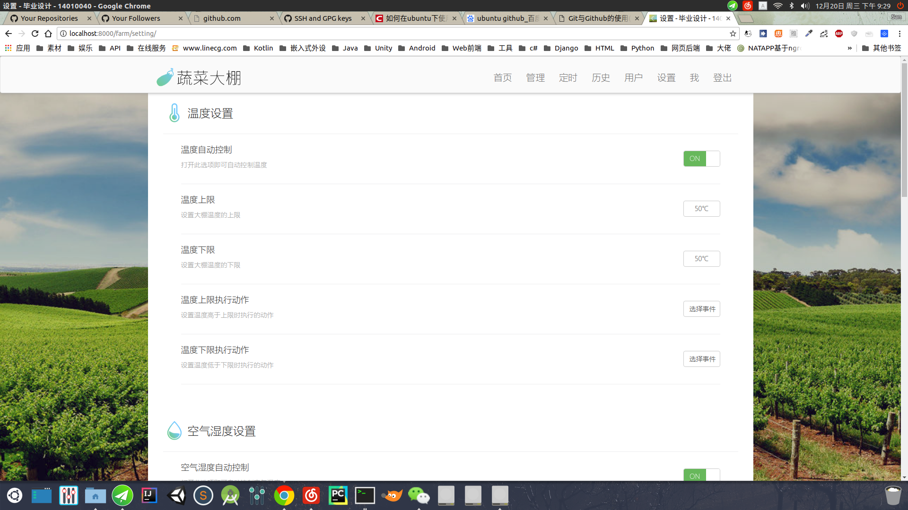
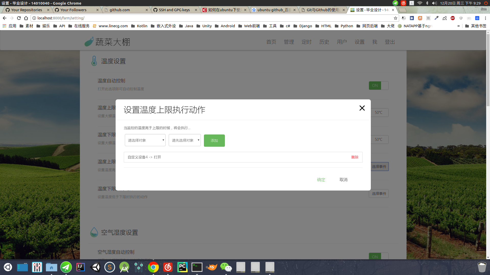

## 毕业设计 - 农业温室大棚

快毕业了，是时候准备毕业设计了，这里记录了咱毕业设计的全部内容以及源代码

具体功能是是通过STM32与传感器与控制器联动，进行控制，并将数据传输到树莓派中的数据库存起来，并且对外提供一个WEB服务器和API，可以通过浏览器和客户端进行控制访问和联动

### 当前进度
#### 后台服务器/数据库
1. URL定向 
2. 数据库设计 
3. 用于APP的登录认证
4. 用于Web的登录认证 
4. 配置文件的读写保存 
5. 历史记录功能 
6. 定时 

#### Web
1. 用户 
2. 管理与配置 
3. 用户管理 
4. 历史记录查看 
5. 定时 

#### Android
1. UI界面 
2. 登录验证保存 
3. 配置与控制 
4. 定时 
5. 用户管理 
6. 报警通知 

#### 嵌入式
1. STM32的传感器信息读取 
2. STM32的外设控制 
3. 树莓派与STM32的交互 
4. 域名 
5. 内网穿透 

### 功能
1. 远程监视控制大棚情况
2. 异常报警与异常阈值调节
3. 定时任务
4. 历史记录
5. 报警提醒
6. 多用户管理

### 进度展示

 

